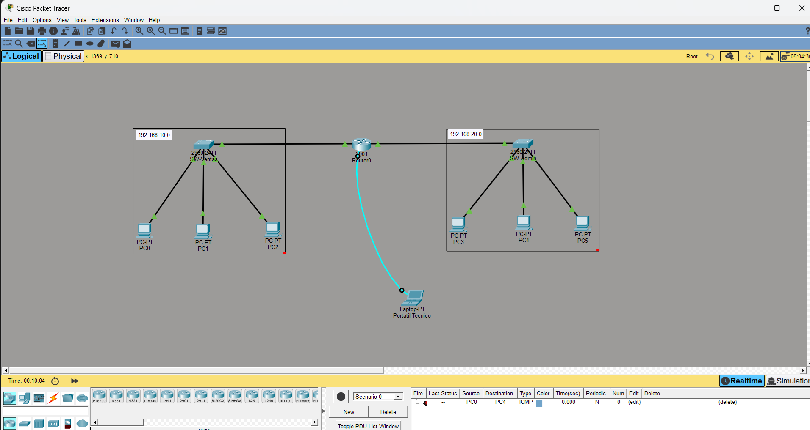

# 🌐 Cisco Packet Tracer & Redes Básicas

Documentación técnica, glosario y resumen de prácticas realizadas durante la formación en **Cisco Networking Academy**, impartida en el **Cibernàrium de Barcelona** (Barcelona Activa).

> 📦 Archivo de práctica: [`archivos/equipos_router.pkt`](archivos/equipos_router.pkt) — descárgalo y ábrelo con Cisco Packet Tracer para reproducir la topología.

---

## 📑 Índice

- [1. Conceptos teóricos fundamentales](#1-conceptos-teóricos-fundamentales)
  - [1.1 Direccionamiento IP y máscara de subred](#11-direccionamiento-ip-y-máscara-de-subred)
  - [1.2 Default Gateway (puerta de enlace predeterminada)](#12-default-gateway-puerta-de-enlace-predeterminada)
  - [1.3 Diagnóstico y protocolos de red](#13-diagnóstico-y-protocolos-de-red)
  - [1.4 Segmentación de red](#14-segmentación-de-red)
- [2. Práctica: topología inter-subred con router y gestión por consola](#2-práctica-topología-inter-subred-con-router-y-gestión-por-consola)
  - [2.1 Diagrama de la arquitectura](#21-diagrama-de-la-arquitectura)
  - [2.2 Plan de direccionamiento](#22-plan-de-direccionamiento)
  - [2.3 Configuración CLI del router](#23-configuración-cli-del-router)
  - [2.4 Verificación de la conectividad](#24-verificación-de-la-conectividad)
- [Palabras clave](#-palabras-clave)

---

## 1. Conceptos teóricos fundamentales

### 1.1 Direccionamiento IP y máscara de subred

- **Dirección IP (IPv4):** identificador lógico único asignado a cada dispositivo dentro de una red de comunicaciones (ejemplo: `192.168.10.2`).
- **Máscara de subred:** delimita qué porción de la IP identifica a la red y cuál a los hosts individuales. Una máscara `255.255.255.0` equivale a la notación CIDR `/24` (24 bits de red, 8 bits de host).
- **IPv6:** versión del protocolo de red de 128 bits diseñada para reemplazar a IPv4, con un espacio de direcciones muchísimo mayor.

### 1.2 Default Gateway (puerta de enlace predeterminada)

Es la dirección IP asignada a la interfaz del **router** conectada a la red local. Es el punto de salida obligatorio cuando un equipo intenta enviar un paquete fuera de su propia subred.

### 1.3 Diagnóstico y protocolos de red

- **ICMP (Internet Control Message Protocol):** protocolo de capa de red utilizado para la notificación de errores y diagnósticos. Lo usan comandos como `ping` y `traceroute`.
- **ARP (Address Resolution Protocol):** asocia direcciones IP (Capa 3) con sus correspondientes direcciones físicas MAC (Capa 2).
  - `arp -a`: muestra las entradas de la tabla caché ARP del equipo.
  - `arp -d`: limpia la tabla caché ARP.
- **Dirección de broadcast (`ffff.ffff.ffff.ffff`):** dirección MAC especial reservada para enviar una trama a todos los dispositivos del mismo segmento de difusión de red.

### 1.4 Segmentación de red

- **LAN (Local Area Network):** red de área local que interconecta ordenadores en un ámbito geográfico limitado.
- **VLAN (Virtual LAN):** red de área local lógica creada dentro de un switch físico para segmentar el tráfico, aislar dominios de difusión y mejorar la seguridad.

### 💡 Para el examen
- Máscara `255.255.255.0` = `/24`. Conviene dominar la equivalencia máscara ↔ CIDR.
- `ping` y `traceroute` funcionan sobre **ICMP**; ARP resuelve **IP → MAC**.
- Dos PCs de subredes distintas solo se comunican a través del **default gateway** (el router).

[⬆ Volver al índice](#-índice)

---

## 2. Práctica: topología inter-subred con router y gestión por consola

### 2.1 Diagrama de la arquitectura



Dos subredes conectadas a un mismo router, cada una con su switch, y un portátil de gestión conectado al puerto de consola del router.

### 2.2 Plan de direccionamiento

#### 🔹 Subred 1: Ventas (`192.168.10.0/24`)

| Elemento | Valor |
|---|---|
| Switch | `SW-Ventas` |
| Default Gateway | `192.168.10.1` (interfaz `Gig0/0` del router) |
| Hosts | `PC0` (`192.168.10.2`) · `PC1` (`192.168.10.3`) · `PC2` (`192.168.10.4`) |

#### 🔹 Subred 2: Administración (`192.168.20.0/24`)

| Elemento | Valor |
|---|---|
| Switch | `SW-Admin` |
| Default Gateway | `192.168.20.1` (interfaz `Gig0/1` del router) |
| Hosts | `PC3` (`192.168.20.2`) · `PC4` (`192.168.20.3`) · `PC5` (`192.168.20.4`) |

#### 🔹 Equipo de gestión de mantenimiento

`Portatil-Tecnico` conectado a la interfaz **Console** del router mediante cable azul **RS-232 a Consola**. La gestión por consola no usa la red: funciona aunque las interfaces del router estén sin configurar.

### 2.3 Configuración CLI del router

Comandos ejecutados desde la **Terminal** del `Portatil-Tecnico` para habilitar el enrutamiento inter-subred:

```text
Router> enable
Router# configure terminal

! Configuración de la interfaz hacia la red Ventas (192.168.10.0)
Router(config)# interface GigabitEthernet0/0
Router(config-if)# ip address 192.168.10.1 255.255.255.0
Router(config-if)# no shutdown
Router(config-if)# exit

! Configuración de la interfaz hacia la red Administración (192.168.20.0)
Router(config)# interface GigabitEthernet0/1
Router(config-if)# ip address 192.168.20.1 255.255.255.0
Router(config-if)# no shutdown
Router(config-if)# exit

! Guardar cambios en NVRAM
Router(config)# end
Router# write memory
```

**Recordatorio de los modos de la CLI:**

| Prompt | Modo | Se entra con |
|---|---|---|
| `Router>` | Usuario (EXEC) | — |
| `Router#` | Privilegiado | `enable` |
| `Router(config)#` | Configuración global | `configure terminal` |
| `Router(config-if)#` | Configuración de interfaz | `interface [nombre]` |

### 2.4 Verificación de la conectividad

Desde cualquier PC de una subred:

```text
C:\> ipconfig            ! Comprobar IP, máscara y gateway asignados
C:\> ping 192.168.10.1   ! Ping al gateway propio
C:\> ping 192.168.20.2   ! Ping a un host de la otra subred (atraviesa el router)
```

Y desde el router:

```text
Router# show ip interface brief   ! Estado de las interfaces (up/up)
Router# show running-config       ! Configuración activa
```

### 💡 Para el examen
- `no shutdown` es imprescindible: las interfaces de un router Cisco vienen administrativamente apagadas por defecto.
- `write memory` (o `copy running-config startup-config`) guarda la configuración en **NVRAM**; sin esto se pierde al reiniciar.
- Las líneas que empiezan por `!` son comentarios en la configuración de Cisco IOS.

[⬆ Volver al índice](#-índice)

---

## 🔑 Palabras clave

*IPv4 · IPv6 · subnet mask · CIDR /24 · default gateway · ICMP · ping · traceroute · ARP · MAC address · broadcast · LAN · VLAN · router · switch · console (RS-232) · Cisco IOS · enable · configure terminal · no shutdown · NVRAM · write memory · show ip interface brief*

---

*Apuntes de prácticas con Cisco Packet Tracer, parte del repositorio [cisco-fundamentos-ciberseguridad](../README.md).*
